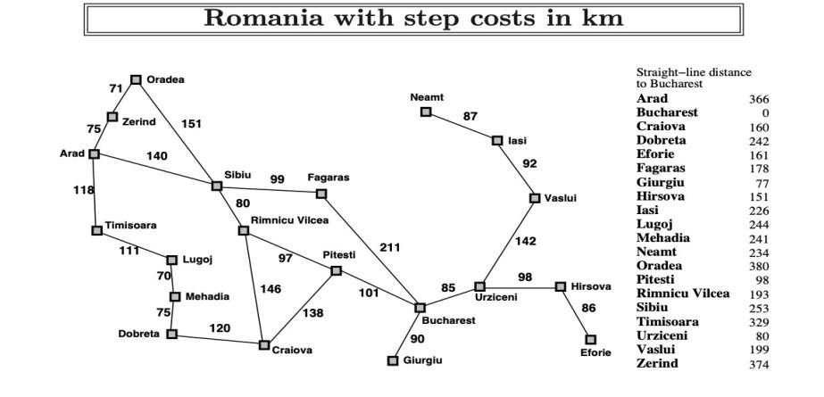

# AI path finding
Find the path from Arad to Bucharest:

## Romania Map

## Algo implementation

Following algorithms are implemented :
-  Depth-First search
- Greedy Best-First search
- Uniform-Cost search
- A* search

|  Search algorithm | Python file name  |
|---|---|
| Depth-First search  |  dfs  |
| Greedy Best-First search  | greedybfs|
|Uniform-Cost search   |  uniform_search |
|   A* search |  astar |

## Ordering 
Places are arranged in ascending ordering of name in the distance matrix

 

